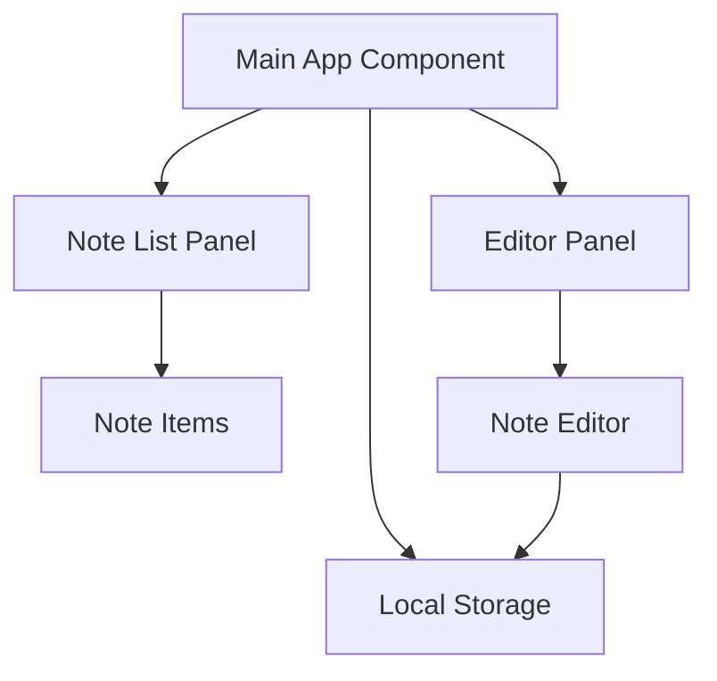
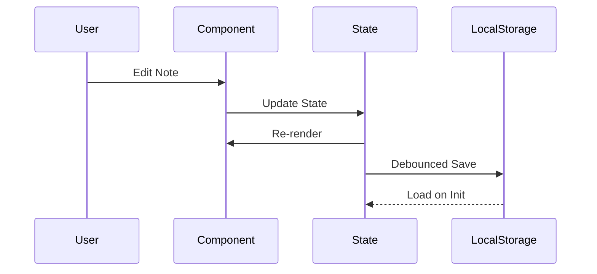

# SiteOne Note-Taking Application Documentation

## Table of Contents
- [Project Overview](#project-overview)
- [Architecture](#architecture)
- [Development Process](#development-process)
- [Implementation Details](#implementation-details)
- [System Components](#system-components)
- [Data Management](#data-management)
- [Setup and Configuration](#setup-and-configuration)
- [Testing and Validation](#testing-and-validation)
- [Deployment](#deployment)
- [Security](#security)
- [Performance](#performance)
- [Maintenance](#maintenance)

## Project Overview

SiteOne is a modern note-taking application built with Next.js 14, TypeScript, and Tailwind CSS. It features a split-panel layout with real-time synchronization to local storage, dark mode support, and smooth animations.

### Key Features
- Split-panel interface with notes list and editor
- Real-time auto-saving
- Dark mode support
- Responsive design
- Offline-first architecture using local storage
- Smooth transitions and animations

## Architecture



### Component Structure
- **Main App (`page.tsx`)**: Root component managing state and layout
- **Note Editor**: Memoized component for content editing
- **Note List**: Dynamic list of notes with selection functionality
- **Storage Layer**: Browser's Local Storage integration

## Development Process

### 1. Project Setup
```bash
# Initialize Next.js project with TypeScript
npx create-next-app@latest siteone --typescript --tailwind --app

# Install dependencies
npm install
```

### 2. Type Definitions
```typescript
// src/app/types/note.ts
export interface Note {
  id: string;
  content: string;
  createdAt: string;
  updatedAt: string;
}

export interface NoteStore {
  notes: Note[];
  activeNoteId: string | null;
}
```

### 3. Core Implementation
The application is built using React's modern features:
- `useState` for state management
- `useCallback` for memoized functions
- `useEffect` for side effects
- `useMemo` for computed values
- `memo` for component optimization

## Implementation Details

### State Management
```typescript
const [noteStore, setNoteStore] = useState<NoteStore>({
  notes: [],
  activeNoteId: null
});
```

### Local Storage Integration
```typescript
const debouncedSave = useCallback(
  debounce((data: NoteStore) => {
    localStorage.setItem(STORAGE_KEY, JSON.stringify(data));
  }, 500),
  []
);
```

### Performance Optimizations
1. Debounced auto-save
2. Memoized components
3. Optimized re-renders
4. Efficient state updates

## System Components

### 1. Note List Panel
- Displays all notes
- Supports note selection
- Shows preview of note content
- Includes creation timestamp
- Delete functionality

### 2. Editor Panel
- Real-time content editing
- Auto-saving
- Last updated timestamp
- Responsive textarea

## Data Management

### Data Structure
```typescript
interface Note {
  id: string;        // Unique identifier
  content: string;   // Note content
  createdAt: string; // Creation timestamp
  updatedAt: string; // Last update timestamp
}
```

### Storage Implementation
- Uses browser's Local Storage
- JSON serialization/deserialization
- Debounced saves for performance
- Error handling for storage limits

## Setup and Configuration

### Prerequisites
- Node.js 18.x or higher
- npm or yarn

### Installation Steps
```bash
# Clone repository
git clone [repository-url]

# Install dependencies
npm install

# Start development server
npm run dev
```

### Environment Setup
No environment variables required as the application runs entirely in the browser.

## Dependencies
```json
{
  "dependencies": {
    "next": "14.2.3",
    "react": "^18",
    "react-dom": "^18"
  },
  "devDependencies": {
    "typescript": "^5",
    "tailwindcss": "^3.4.1",
    "postcss": "^8.4.35",
    "eslint": "^8"
  }
}
```

## Testing and Validation

### Manual Testing Checklist
1. Note Creation
   - [ ] Create new note
   - [ ] Verify timestamp
   - [ ] Check list update

2. Note Editing
   - [ ] Real-time content updates
   - [ ] Auto-save functionality
   - [ ] Update timestamp

3. Note Deletion
   - [ ] Delete confirmation
   - [ ] List update
   - [ ] Active note handling

4. Storage
   - [ ] Persistence verification
   - [ ] Load state on refresh
   - [ ] Error handling

## Deployment

### Build Process
```bash
# Create production build
npm run build

# Start production server
npm run start
```

### Deployment Considerations
1. Static Export
   - Next.js static export compatible
   - No server-side requirements
   - CDN-friendly

2. Performance
   - Minimal bundle size
   - Optimized assets
   - Client-side caching

## Security

### Data Privacy
- All data stored locally
- No external API calls
- No data transmission

### Best Practices
1. Content Sanitization
2. Local Storage Encryption (if needed)
3. XSS Prevention
4. Input Validation

## Performance Optimization

### Implemented Techniques
1. **Component Optimization**
   - Memoization
   - Debounced updates
   - Efficient re-renders

2. **State Management**
   - Local state
   - Optimized updates
   - Batched changes

3. **Resource Loading**
   - Code splitting
   - Lazy loading
   - Asset optimization

## Maintenance

### Troubleshooting Guide
1. **Local Storage Issues**
   - Clear browser cache
   - Check storage quota
   - Verify JSON integrity

2. **Performance Problems**
   - Monitor re-renders
   - Check component memoization
   - Verify debounce timing

### Update Procedure
1. Update dependencies
2. Run tests
3. Build production version
4. Deploy updates

## Error Handling

### Implemented Error Handlers
```typescript
try {
  localStorage.setItem(STORAGE_KEY, JSON.stringify(data));
} catch (error) {
  console.error('Error saving notes:', error);
  // Implement user notification
}
```

### Common Error Scenarios
1. Storage quota exceeded
2. Invalid JSON data
3. Browser compatibility issues

## Data Flow



This documentation provides a comprehensive overview of the SiteOne note-taking application. For additional details or specific implementation questions, refer to the source code or create an issue in the project repository.